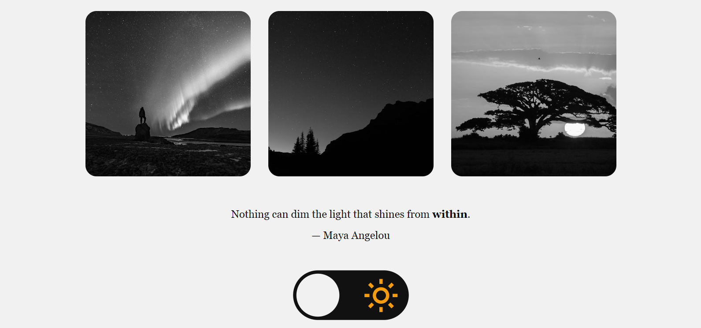
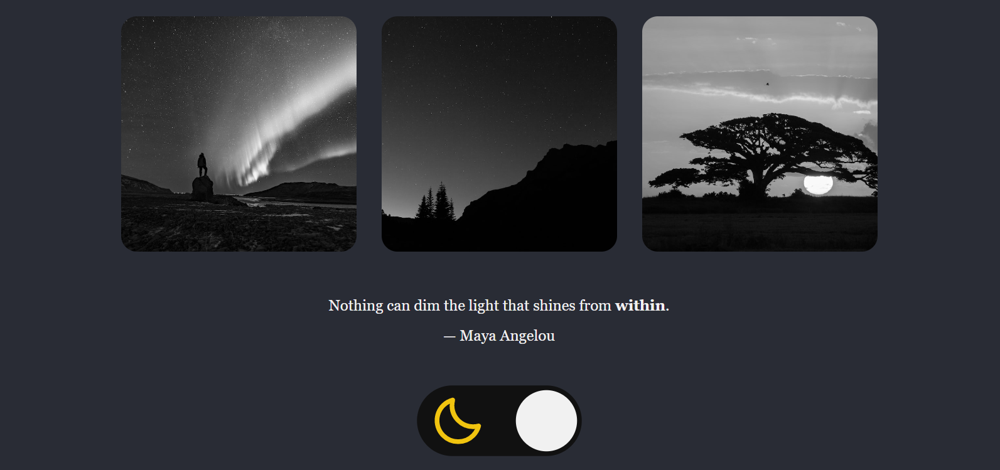

# Página com alternância de tema claro/escuro

## Descrição do Projeto

Uma página que contém um toggle para alternar entre o tema dark e light, realizada a partir das diretrizes do <a href="https://efficient-sloth-d85.notion.site/Desafio-Theme-Switcher-dbabdf77f70d43298df382c8e805fc13">desafio da Rocketseat!</a>

<h1 align="center">
  
</h1>
<h1 align="center">
  
</h1>

### 🛠 Tecnologias

As seguintes ferramentas foram usadas na construção do projeto:

- [HTML](https://developer.mozilla.org/pt-BR/docs/Web/HTML)
- [CSS](https://developer.mozilla.org/pt-BR/docs/Web/CSS)
- [JavaScript](https://developer.mozilla.org/pt-BR/docs/Web/JavaScript)

### Autor
---

Feito por Nathalia Azevedo 👋🏽 Entre em contato!

